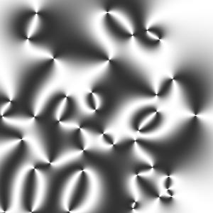
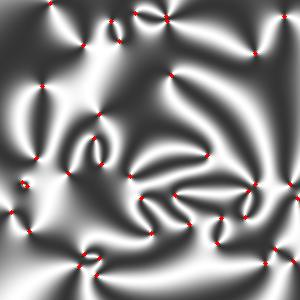
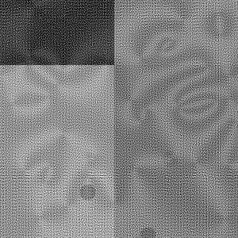
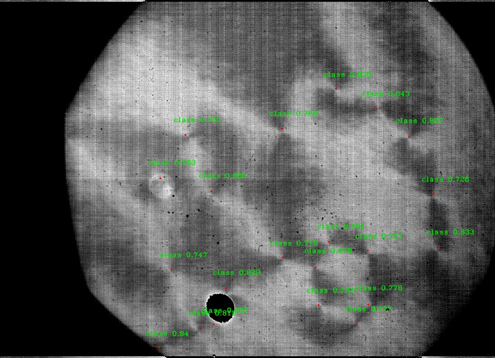

# SETT

### System for Enhancing simulated images, Training darkflow models, and Tracking

## Setup

SETT is organized into several submodules, each of which can be used independently from the others. When SETT is first cloned, each submodule will only be represented by an empty folder. In order to retrieve the contents of each submodule, use the command 
```
git submodule update --init --recursive
```
Future pulls can be done using
```
git pull --recurse-submodules
```

The system has been tested using anaconda with python 3.6 on both linux and windows.
to get requirements run 
```
pip install -r requirements.txt
```

Darkflow has its own setup that needs to be run inside the main darkflow folder. Choose one of three options. The first option is recommended, however all three will work.

1. Just build the Cython extensions in place. NOTE: If installing this way you will have to use `./flow` in the cloned darkflow directory instead of `flow` as darkflow is not installed globally.
```
    python setup.py build_ext --inplace
```
2. Let pip install darkflow globally in dev mode (still globally accessible, but changes to the code immediately take effect)
```
    pip install -e .
```

3. Install with pip globally
```
    pip install .
```

All requirements should now be installed and SETT will be ready for usage.

## Basic SETT usage
SETT is run by feeding .yml config files to overlord.py using 
```
python overlord.py config.yml
```
The default config.yml file shows what layout the config files should have. Groups of .yml files can also be run through SETT to run a series of jobs. This is also done be running a .yml file to overlord.py, similar to executing a single config file. 
```
python overlord.py jobs.yml
```
The default jobs.yml file shows the format needed for the batch job execution behavior. The option macro controls whether a .yml file is interpretted as a batch scheduler or a single job.

## Functionality
SETT implements a multi-stage process for developing machine learning models from simulated images. The system is designed to be fully modular, allowing components to be swapped in or out and run independently

The full workflow is as follows when all meta options are set to yes (except for runName)

**Run Simulation:** A simulation is run that generates simulated images. The simulation script location is pointed to by paths: simRunner and the function at paths:simFunc is called. Along with simulated images, an xml file for each image should be generated containing the locations of the bounding boxes for objects to be detected. The default simulation generates images and annotations for topological defects.

**Extract Smart Noise:** If you have an experimental image, the smartNoise module can extract the fourier noise from that image. The extracted noise is periodic noise, generally caused by camera or lighting inaccuracies. This noise can then be added to simulation images in the next step, image enhancement.

**Enhance Simulated Images:** This step applies various types of noise and artifacts to simulated images. The enhancement process is meant to enhance the usefulness of the simulated images for training machine learning models and will make the images look much less clean. By using the enhanced images, a machine learning model will learn to be more robust and capable of identifying objects in real images instead of just perfect simulation images.

**Model Training:** Here we make use of darkflow, a tensorflow implementation of YOLOv2. In order to train properly, the paths to the training images and their associated xml annotations, both of which should have been generated earlier in the pipeline, must be set. Training the model will take an incredibly long time on a CPU, which is why using the GPU is recommended. Epoch controls how many rounds of training will occur. When training is finished, the model will be saved as a .pb and a .meta file

**Running the Model:** The trained model can now be used to detect objects in a new images. A new folder will be generated in the target directory containing the detections in a .json file. The new folder will also contain images with the detections shown.

**Validation:** For the final step in the process, the detections made by the model can be checked against ground-truth annotations to determine how accurate the model is. The distance between a ground truth object and a detection needed to count as a match can be set. A results.txt file will be saved containing the number of detections made, the number of correction detections, and the number of ground-truth objects.

If saveRun is set to yes, the generated model and the validation results.txt file will be saved in a folder with the designated run name.


## Sample Images

*Simulation Image. This image was created by the XY model to be visually similar to experimental defect observations*


*Simulation Image with red marks denoting the location of defects. The marks were created by the simulation which has a perfect knowledge of their location*


*Simulation Image after being run through the image enhancement module. By training a model with a large number of images with random artifacts, the final detector will be robust enough to work on real data*


*Image taken from a real experiment. The markings were generated by a model trained on enhanced simulation data. The model achieved around 90% recall and 70% precision on a set of hand-annotated experimental data.*

